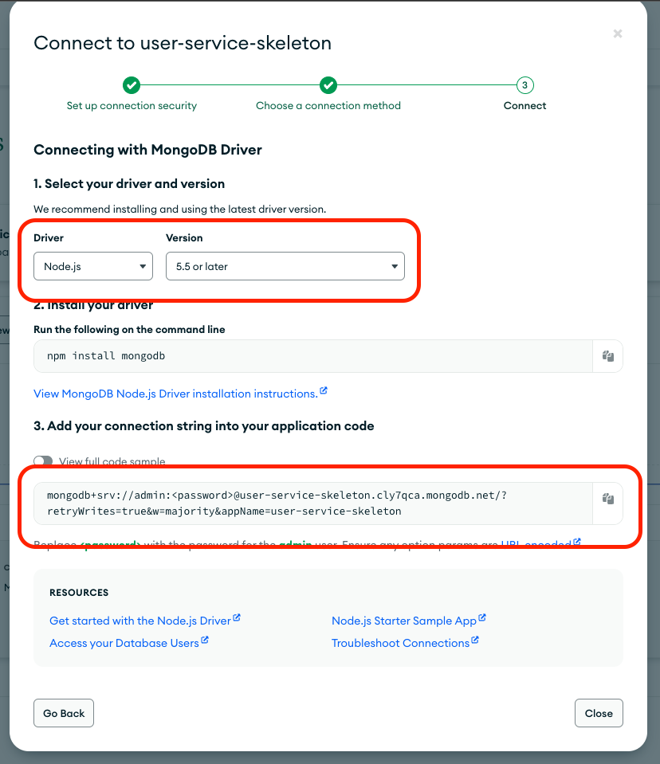

# Question Service Database Guide

## Setting-up 

> :notebook: If you are familiar to MongoDB and wish to use a local instance, please feel free to do so. This guide utilizes MongoDB Cloud Services.

1. Set up a MongoDB Shared Cluster by following the steps in this [Guide](../user-service/MongoDBSetup.md).

2. After setting up, go to the Database Deployment Page. You would see a list of the Databases you have set up. Select `Connect` on the cluster you just created earlier on for Question Service.

   

3. Select the `Drivers` option, as we have to link to a Node.js App (Question Service).

   

4. Select `Node.js` in the `Driver` pull-down menu, and copy the connection string.

   Notice, you may see `<password>` in this connection string. We will be replacing this with the admin account password that we created earlier on when setting up the Shared Cluster.

   

5. Update the `MONGODB_URI` of the `.env` file, and paste the string we copied earlier in step 4. Also remember to replace the `<password>` placeholder with the actual password. Leave `MONGODB_NAME` empty.

## Running Question Service

1. Open Command Line/Terminal and navigate into the `question-service` directory.

2. Run the command: `npm install`. This will install all the necessary dependencies.

3. Run the command `npm start` to start the Question Service in production mode, or use `npm start:dev` for development mode, which includes features like automatic server restart when you make code changes.

4. Using applications like Postman, you can interact with the Question Service on port 8001.

5. After starting the Question Service, you can access the documentation here [Api Documentation](http://localhost:8001/docs)
